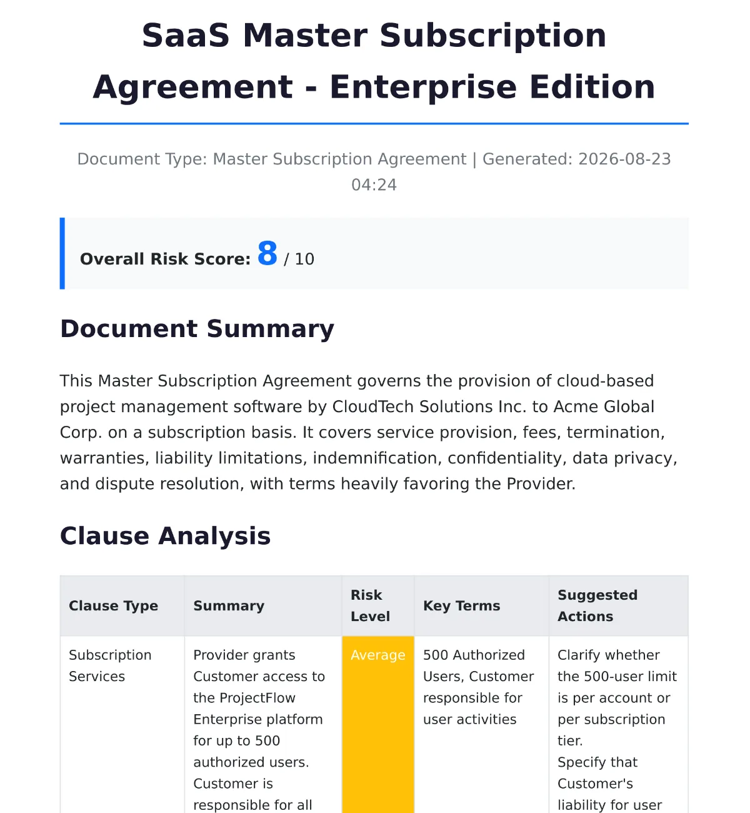
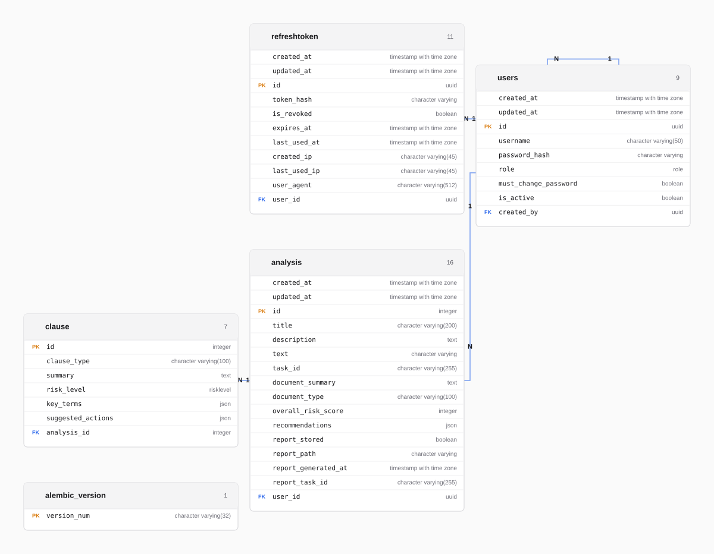
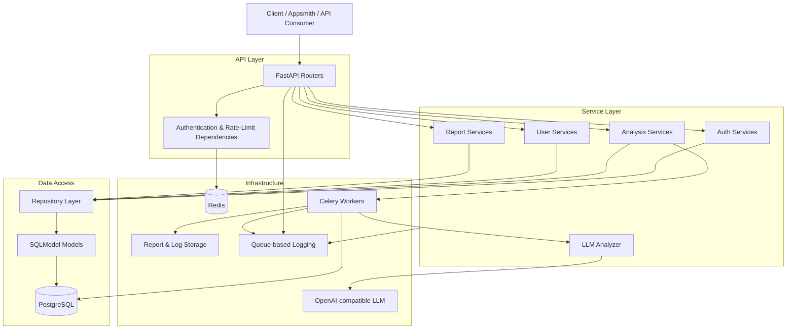
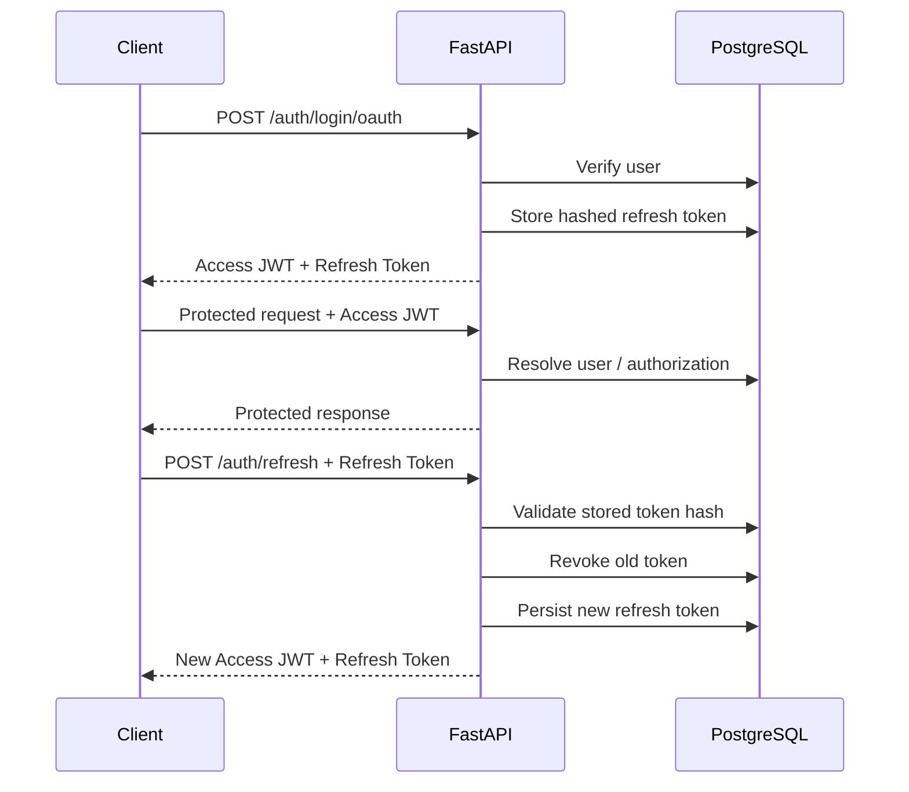

<h1 align="center">
  Contract Clause Reviewer
</h1>

<p align="center">
  An AI-powered contract analysis service built with FastAPI, layered architecture, Celery, Redis and PostgreSQL.
</p>

<p align="center">
  
  
  
  
  
  
  
  
  
</p>

<p align="center">
  
</p>

---

# Contract Clause Reviewer

Contract Clause Reviewer is a portfolio project for exploring how an AI-powered backend can be structured as a production-oriented service rather than as a single FastAPI application.

The application accepts contract text, sends the document to an LLM for structured analysis, stores the resulting clauses and risk information, and can generate a downloadable PDF report.

The project focuses primarily on the engineering behind the product:

- Layered architecture with explicit separation of responsibilities
- Dependency injection through FastAPI dependencies
- Asynchronous HTTP, database and Redis I/O at the API boundary
- Celery-based background processing for LLM analysis and PDF generation
- PostgreSQL persistence with SQLModel and Alembic
- Local JWT authentication with access/refresh token workflow
- Refresh-token rotation and server-side token persistence
- Role-based access control for administrative endpoints
- Redis-backed global and endpoint-specific rate limiting
- Queue-based application logging with dedicated audit logging
- Dockerized API and worker deployment
- Unit and integration test separation

This is primarily an architecture and backend engineering portfolio project. It is not intended to replace professional legal review.

---

# Features

## Contract Analysis

Users can submit contract text for asynchronous analysis.

The analysis service:

- identifies key contract clauses
- classifies clause types
- assigns clause-level risk levels
- calculates an overall document risk score
- produces a document summary
- highlights key terms
- provides suggested actions and recommendations

LLM output is validated against a Pydantic schema before it is persisted.

The current analyzer also applies a maximum document length and truncates long documents at a paragraph boundary where possible.

## Background Processing

LLM analysis and PDF generation are deliberately kept out of the request/response path.

The API queues Celery tasks and immediately returns a task identifier. Workers perform the expensive operations and persist the results.

Celery is configured with:

- dedicated analysis and cleanup queues
- task retry policies
- exponential retry backoff with jitter
- late acknowledgements
- task time limits
- worker concurrency control
- periodic cleanup tasks

## Authentication and RBAC

Authentication uses a local JWT workflow.

Access tokens are short-lived JWTs containing a subject, token type, expiry and JTI. Refresh tokens are opaque random values and only their SHA-256 hashes are persisted in the database.

The authentication layer supports:

- access-token validation
- refresh-token validation
- refresh-token rotation
- token revocation
- session metadata such as IP address and user-agent
- active-user checks
- admin-only dependencies

See [`docs/authentication.md`](docs/authentication.md) for the complete workflow.

## Rate Limiting

Redis is used for rate limiting at multiple levels.

The project includes:

- global per-IP protection
- login-specific limits
- public endpoint limits
- authenticated-user limits
- stricter analysis limits
- admin endpoint limits
- reusable custom rate-limit dependencies

Rate-limit information is exposed through standard response headers such as `X-RateLimit-Limit`, `X-RateLimit-Remaining`, `X-RateLimit-Reset` and `Retry-After`.

## Logging and Auditing

The application uses a queue-based logging pipeline so application code does not synchronously perform file I/O for every log record.

The logging infrastructure uses:

- `QueueHandler`
- `QueueListener`
- rotating application logs
- separate error and warning logs
- access logging
- a dedicated audit log
- custom `AuditLogger` helpers
- graceful queue flushing during shutdown

User and administrator actions are represented as structured key/value log messages so operational events are easier to search and inspect.

## PDF Report Generation

Completed analyses can be converted into PDF reports.

The report pipeline is:

```text
Analysis in PostgreSQL
        |
        v
Celery report task
        |
        v
HTML report generation
        |
        v
WeasyPrint
        |
        v
PDF file in reports storage
        |
        v
Analysis record updated with report metadata
```

An example report is included at [`docs/example_report.pdf`](docs/example_report.pdf).

---

# Screenshots

<p align="center">
  
</p>

<p align="center">
  Example generated report showing document summary, overall risk and clause-level findings.
</p>

## Database Structure

<p align="center">
  
</p>

---

# Architecture

The application follows a layered architecture with infrastructure concerns kept separate from business-oriented services.



The main application boundaries are:

```text
API
 ├── routing
 ├── request/response concerns
 ├── authentication dependencies
 └── rate-limit dependencies

Services
 ├── business workflows
 ├── authentication logic
 ├── analysis orchestration
 ├── user operations
 └── report orchestration

Repositories
 └── database access capabilities

Models / Schemas
 ├── persistence models
 └── API / validation models

Core
 ├── configuration
 ├── security primitives
 ├── Celery configuration
 ├── enums / exceptions
 └── reusable application utilities

Infrastructure
 ├── Redis
 ├── OpenAI client integration
 ├── file storage
 └── logging

Tasks
 ├── document analysis
 ├── report generation
 └── cleanup jobs
```

The architecture is intentionally layered rather than trying to implement a fully abstract Clean Architecture or hexagonal architecture. The goal is to get most of the practical benefits of separation and testability without excessive indirection.

More detail is available in [`docs/architecture.md`](docs/architecture.md).

---

# Backend

The backend is built with:

<ul>
<li><b>FastAPI:</b> API framework and dependency injection</li>
<li><b>SQLModel:</b> database models and SQLAlchemy integration</li>
<li><b>PostgreSQL:</b> primary relational database</li>
<li><b>Alembic:</b> database migrations</li>
<li><b>Celery:</b> distributed background task processing</li>
<li><b>Redis:</b> Celery broker/result backend and rate-limit storage</li>
<li><b>Pydantic:</b> request, response and LLM output validation</li>
<li><b>Granian:</b> ASGI application server</li>
<li><b>WeasyPrint:</b> HTML-to-PDF report generation</li>
<li><b>OpenAI-compatible API:</b> LLM integration</li>
</ul>

The Python project requires Python 3.14+ and uses `uv` for dependency management.

---

# Async I/O and Work Offloading

The HTTP application uses asynchronous database and Redis clients and asynchronous OpenAI calls.

The important design distinction is that the worker boundary is intentionally synchronous:

```text
HTTP request
     |
     | async
     v
FastAPI
     |
     | queue task
     v
Celery
     |
     | worker process
     v
CPU / blocking / long-running work
     |
     +--> LLM analysis
     +--> database persistence
     +--> PDF generation
```

This means the API remains responsive while long-running analysis and report-generation work is handled by worker processes.

Celery tasks are synchronous functions by design. The document analysis task bridges to the asynchronous LLM service inside the worker process, while database persistence and PDF generation are performed synchronously within the task.

This is more accurate than describing the entire system as "fully async": the web layer is async-first, while background workers intentionally isolate blocking work.

---

# Database

PostgreSQL stores:

- users
- refresh-token records
- analyses
- analyzed clauses
- report metadata

SQLModel models live in `app/models/`, while database access is organized through repository functions in `app/repositories/`.

The application has both:

- an async database URL for the API
- a sync database URL for Celery workers

Alembic is used for schema migrations.

---

# Authentication Flow



Access tokens are short-lived JWTs. Refresh tokens are opaque values whose hashes are stored server-side.

This avoids putting refresh-token secrets directly into the database and makes server-side revocation possible.

---

# Security

The project includes several security-oriented controls:

- password hashing with Argon2 through `pwdlib`
- short-lived JWT access tokens
- opaque refresh tokens
- refresh-token rotation
- refresh-token revocation
- server-side refresh-token persistence
- JTI values on access tokens
- active-user checks
- admin-only dependencies
- Redis-backed rate limiting
- audit logging for sensitive actions
- environment-based secrets and database configuration

This portfolio project should still be treated as a learning system rather than as a security-certified legal product. Production deployment would require additional controls such as secrets management, HTTPS termination, hardened cookie/CORS policy where applicable, security headers, monitoring and a formal threat model.

---

# Deployment

Docker is used to run the production-shaped application as separate services.

The Compose setup contains:

```text
PostgreSQL
    |
    +------------------+
    |                  |
    v                  v
 FastAPI API       Celery worker
    |                  |
    +--------+---------+
             |
           Redis
```

The Dockerfile provides separate build targets for:

- `api`
- `celery-worker`

The runtime image includes:

- Python 3.14
- a non-root `appuser`
- cached `uv` dependency installation
- WeasyPrint system dependencies
- application health checks for the API

Docker Compose also provides persistent volumes for PostgreSQL, Redis, reports and logs.

---

# Appsmith

---

# How To Run

## Requirements

Make sure the following tools are installed:

- Python 3.14+
- uv
- Docker
- Docker Compose

An OpenAI-compatible API endpoint is also required for actual document analysis.

## Development Setup

Clone the repository:

```bash
git clone https://github.com/enoorii/contract-clause-reviewer.git
cd contract-clause-reviewer
```

Install Python dependencies:

```bash
uv sync
```

Create the environment file:

```bash
cp .env.example .env
```

Set the required LLM configuration and review the database, Redis, authentication and application settings in `.env`.

Start the development services:

```bash
docker compose up -d --build
```

This will run alembic migrations using the existing migration file in the repo.

The API is exposed on:

```text
http://localhost:9000
```

OpenAPI documentation is available at:

```text
http://localhost:9000/docs
```

## Generate Alembic Migrations

To do this you should run database using `docker-compose.test.yaml` and then run alembic.

```text
docker compose -f docker-compose.test.yaml --env-file .env.test up -d
ENV_FILE=.env.test uv run alembic revision --autogenerate -m "message"
```

---

# Running Celery Manually

For development without the full Compose worker:

```bash
ENV_FILE=.env.test uv run celery \
  -A app.core.celery:celery_app \
  worker \
  --loglevel=info \
  -Q analysis
```

Run the API separately:

```bash
ENV_FILE=.env.test uv run granian \
  --interface asgi \
  app.main:app \
  --host 0.0.0.0 \
  --port 8000
```

For hot reload during development:

```bash
ENV_FILE=.env.test uv run granian \
  --reload \
  --interface asgi \
  app.main:app \
  --host 0.0.0.0 \
  --port 8000
```

---

# Testing

The test suite is separated into unit and integration tests:

```text
tests/
├── conftest.py
├── unit/
│   ├── core/
│   └── services/
└── integration/
    ├── api/
    └── middleware/
```

The test environment is designed to minimize external dependencies:

- `py-pglite` is used for PostgreSQL-compatible database testing
- `fakeredis` is used for Redis-dependent tests
- pytest-asyncio handles async test execution

Run the full suite:

```bash
ENV_FILE=.env.test uv run pytest
```

Run a specific test module:

```bash
ENV_FILE=.env.test uv run pytest tests/integration/api/test_auth.py -v
```

Run tests matching a name:

```bash
ENV_FILE=.env.test uv run pytest -k "login"
```

See [`docs/testing.md`](docs/testing.md) for the testing strategy and fixture design.

---

# Project Structure

```text
contract-clause-reviewer/
├── alembic/
│   └── versions/
├── app/
│   ├── api/
│   │   ├── analysis.py
│   │   ├── auth.py
│   │   ├── deps.py
│   │   ├── reports.py
│   │   └── users.py
│   ├── core/
│   │   ├── filters/
│   │   ├── celery.py
│   │   ├── config.py
│   │   ├── enums.py
│   │   ├── exceptions.py
│   │   ├── security.py
│   │   └── utilities.py
│   ├── db/
│   │   ├── database.py
│   │   └── seed.py
│   ├── infrastructure/
│   │   ├── openai/
│   │   ├── redis/
│   │   ├── logging.py
│   │   └── storage.py
│   ├── middleware/
│   │   ├── rate_limit.py
│   │   └── request_logging.py
│   ├── models/
│   │   └── models.py
│   ├── repositories/
│   │   ├── analysis_repositories.py
│   │   ├── refresh_token_repositories.py
│   │   └── user_repositories.py
│   ├── schemas/
│   │   ├── analysis.py
│   │   ├── base.py
│   │   ├── report.py
│   │   └── users.py
│   ├── services/
│   │   ├── analysis.py
│   │   ├── auth.py
│   │   ├── document_analyzer.py
│   │   ├── report_generator.py
│   │   ├── reports.py
│   │   ├── services.py
│   │   └── users.py
│   ├── tasks/
│   │   ├── cleanup_tasks.py
│   │   ├── document_tasks.py
│   │   └── report_tasks.py
│   └── main.py
├── docs/
│   ├── images/
│   │   ├── report.webp
│   │   └── table-structure.svg
│   ├── example_llm_schema.json
│   └── example_report.pdf
├── tests/
│   ├── integration/
│   │   ├── api/
│   │   └── middleware/
│   ├── unit/
│   │   ├── core/
│   │   └── services/
│   └── conftest.py
├── .env.example
├── .env.test.example
├── Dockerfile
├── docker-compose.yaml
├── docker-compose.test.yaml
├── alembic.ini
├── pyproject.toml
└── uv.lock
```

---

# Documentation

More detailed engineering notes are kept under `docs/`:

- [`architecture.md`](docs/architecture.md) — layer responsibilities, dependency direction and design decisions
- [`authentication.md`](docs/authentication.md) — JWT, refresh-token rotation and RBAC workflow
- [`background-processing.md`](docs/background-processing.md) — Celery queues, retries and worker design
- [`testing.md`](docs/testing.md) — unit/integration strategy and test infrastructure
- [`appsmith.md`](docs/appsmith.md) — planned Appsmith dashboard integration
- [`example_report.pdf`](docs/example_report.pdf) — sample generated report
- [`example_llm_schema.json`](docs/example_llm_schema.json) — example structured LLM output schema

---

# Design Goals

The project was built around a few practical engineering goals:

### 1. Keep request handlers thin

FastAPI routes should primarily translate HTTP concerns into calls to application services.

### 2. Keep business workflows out of repositories

Repositories expose data-access capabilities. Services compose those capabilities into application operations.

### 3. Offload long-running work

LLM analysis and PDF generation should not block HTTP requests.

### 4. Make infrastructure replaceable

Redis, the LLM provider, file storage and logging live behind infrastructure-oriented modules rather than being scattered across route handlers.

### 5. Make security explicit

Authentication, authorization, refresh-token persistence and rate limiting are treated as first-class application concerns.

### 6. Keep tests independent from external services where possible

The test suite uses test substitutes for PostgreSQL and Redis so most tests can run without starting the full production stack.

---

# Limitations and Future Improvements

This repository intentionally focuses on backend architecture rather than on building a complete commercial legal product.

Some areas that could be expanded in a production system include:

- document upload and extraction from PDF/DOCX files
- streaming or progress events for long-running analyses
- more advanced LLM evaluation and regression testing
- prompt/version management
- model/provider failover
- distributed tracing and metrics
- centralized secrets management
- object storage instead of local report files
- more granular authorization policies
- stronger production security hardening
- CI/CD workflows and automated release management
- the Appsmith dashboard and its integration documentation

---

# License

This project is intended as a portfolio and educational project.
