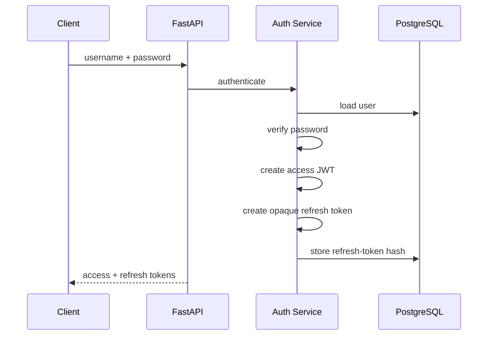

# Authentication and Authorization

The authentication system uses a hybrid JWT + server-side refresh-token design.

## Token Model

The system has two token types.

### Access Token

The access token is a short-lived JWT containing:

```json
{
  "sub": "<username>",
  "type": "access",
  "exp": "<expiry>",
  "jti": "<unique-token-id>"
}
```

The JTI provides a unique identifier for the access-token instance.

### Refresh Token

The refresh token is an opaque random value.

Only its SHA-256 hash is persisted:

```text
raw refresh token
       |
       v
SHA-256
       |
       v
database
```

The raw token is returned to the client but is not stored in plaintext in PostgreSQL.

## Login Flow



Passwords are verified through `pwdlib`.

The password hashing/verification functions are asynchronous wrappers around password hashing so CPU-heavy password operations do not directly block the event loop.

## Access-Token Validation

Protected routes use the FastAPI OAuth2 bearer dependency.

The authentication dependency:

1. extracts the bearer token
2. verifies the JWT signature
3. checks the token type
4. checks expiry
5. validates the JTI
6. resolves the user
7. constructs an application-level `AuthUser`

This keeps route handlers independent from JWT parsing details.

## Active User Checks

Authentication and authorization are separate concepts.

A valid JWT does not automatically mean the user can perform every operation.

The dependency chain is conceptually:

```text
Bearer token
   |
   v
authenticate user
   |
   v
active user?
   |
   +---- no ---> 403
   |
   v
required role?
   |
   +---- no ---> 403
   |
   v
endpoint
```

The application also checks `must_change_password` so administrative provisioning can require a user to establish a new password before normal use.

## RBAC

Roles are represented in the application model.

Administrative routes depend on an admin-specific dependency rather than checking role values inside every handler.

For example:

```python
async def create_user(
    user_data: UserCreate,
    admin: AdminRateLimit,
    db: DBSession,
):
    ...
```

The route receives an `admin` object only after authentication, active-user validation and admin authorization have succeeded.

This avoids repeating:

```python
if user.role != Role.ADMIN:
    ...
```

throughout the API.

## Refresh-Token Rotation

The refresh endpoint rotates refresh tokens.

Conceptually:

```text
old refresh token
        |
        v
hash token
        |
        v
load token record
        |
        v
validate not revoked / not expired
        |
        +---------> revoke old token
        |
        +---------> create new refresh token
        |
        +---------> store new token hash
        |
        v
return new access + refresh pair
```

This prevents a refresh token from becoming a permanent credential.

The database record also stores useful session metadata such as:

- creation IP
- user-agent
- last-used time
- expiration
- revocation state

## Logout

Logout revokes the supplied refresh token.

The endpoint is intentionally idempotent so repeated logout attempts do not create unnecessary state-management problems.

## Scheduled Cleanup

Celery Beat schedules cleanup jobs for:

- expired refresh tokens
- old report files
- orphaned report references

This keeps authentication and report storage data from growing indefinitely.

## Rate-Limited Authentication

Login endpoints receive a stricter Redis-backed limit than ordinary public endpoints.

The current dependency configuration includes a login limit of 10 requests per minute per IP.

Additional limits are applied to authenticated users, administrators and analysis operations.

## Security Notes

This is a portfolio implementation, not a complete identity platform.

For production deployment, consider adding:

- HTTPS everywhere
- secrets management
- secure cookie/token transport strategy
- CSRF protections where cookie authentication is introduced
- key rotation for signing secrets
- stronger account lockout / suspicious-login detection
- audit retention and centralized log storage
- security headers
- formal threat modeling

The important portfolio point is that authentication is implemented as a complete workflow rather than as a single JWT decoding helper.
