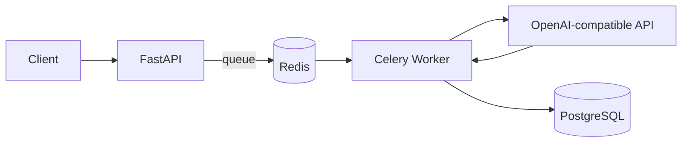

# Background Processing

Contract analysis is potentially slow because it depends on an LLM and because reports require PDF rendering.

The project therefore treats long-running work as background jobs.

## High-Level Flow



Report generation follows a similar path:

```text
API
 |
 | queue report task
 v
Redis
 |
 v
Celery worker
 |
 +--> load analysis
 |
 +--> generate HTML
 |
 +--> WeasyPrint
 |
 +--> save PDF
 |
 +--> update PostgreSQL
```

## Celery Configuration

The Celery application is configured with:

- JSON task serialization
- UTC time
- task-start tracking
- 30-minute hard task time limit
- 25-minute soft task time limit
- worker prefetch multiplier of 1
- worker concurrency of 4
- task retry delay
- three maximum retries
- separate task queues
- result expiration

## Queues

The project routes work into named queues:

```text
analysis
cleanup
```

Analysis queue:

- document analysis
- report PDF generation

Cleanup queue:

- expired refresh-token cleanup
- old report cleanup
- orphaned reference cleanup

This allows worker capacity to be dedicated to different types of work later.

## Task Reliability

The analysis task uses several reliability mechanisms:

### Late acknowledgement

```python
acks_late=True
```

This reduces the chance that a task is permanently acknowledged before a worker has successfully completed it.

### Retry

Tasks can retry failed work.

Retry configuration includes:

- three retries
- delayed retry
- exponential backoff
- maximum backoff
- jitter

Jitter reduces the chance that many failed workers retry at exactly the same time.

### Idempotency

The document analysis task checks whether an analysis record already exists for the Celery task ID before inserting a duplicate analysis.

This is important because background work can be retried.

## Async Boundary

The Celery task itself is synchronous:

```python
def analyze_legal_document_task(...):
    ...
```

The analyzer service is asynchronous:

```python
async def analyze(...):
    ...
```

The worker bridges the two:

```text
Celery sync task
      |
      v
asyncio.run(...)
      |
      v
AsyncOpenAI
```

The point is not to make Celery "async". The point is to keep the web process free while the worker executes the long-running job.

## Task Status

When an analysis is queued, the API returns a Celery task ID.

The client can use that identifier to query task status.

Conceptually:

```text
queued
  |
  v
pending / started
  |
  +----> failed
  |
  v
completed
```

Once the Celery task completes successfully, the analysis is retrieved from PostgreSQL.

The database is treated as the durable record of completed analysis results rather than relying permanently on Celery result storage.

## Report Generation

The PDF task:

1. receives analysis data
2. renders HTML
3. converts HTML to PDF using WeasyPrint
4. writes the PDF to report storage
5. updates the analysis record
6. returns task metadata

Report files use a deterministic name:

```text
report_<analysis_id>.pdf
```

This makes regeneration idempotent from the file-storage perspective.

## Scheduled Cleanup

Celery Beat schedules periodic maintenance:

```text
Daily:
    cleanup expired refresh tokens
    cleanup orphaned report references

Weekly:
    cleanup old report files
```

The weekly report cleanup currently keeps reports for 30 days.

## Scaling

API and worker processes can scale independently.

If LLM analysis becomes the bottleneck:

```text
1 API
  |
  v
Redis
  |
  +--> Worker 1
  +--> Worker 2
  +--> Worker 3
  +--> Worker 4
```

If HTTP traffic becomes the bottleneck instead, the API tier can be scaled independently.

This separation is one of the main architectural reasons for introducing Celery into the project.
